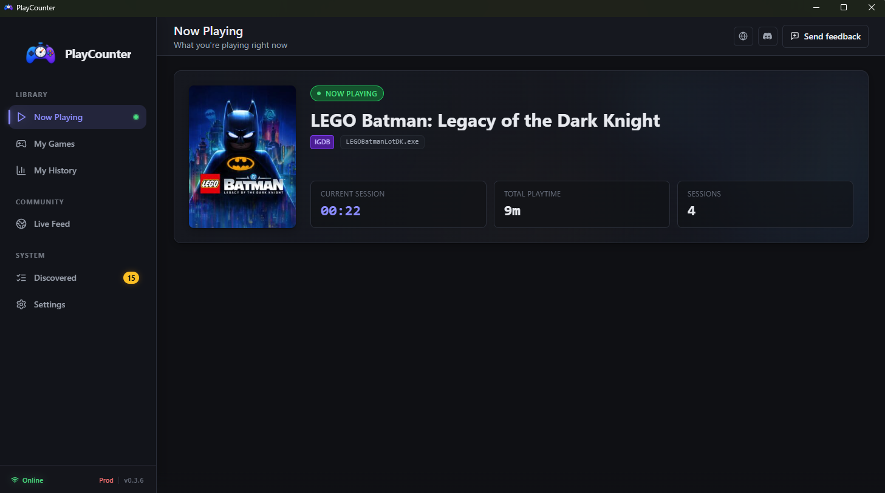
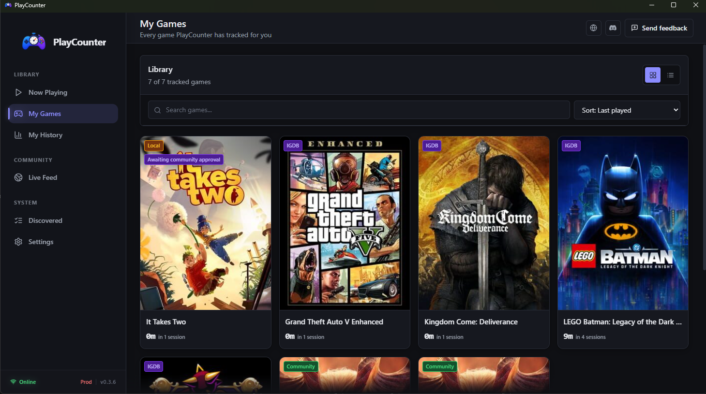
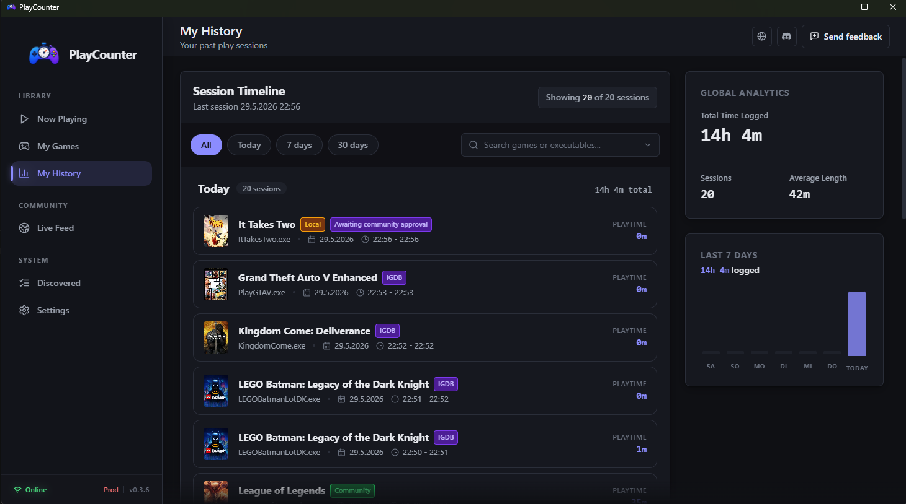

# PlayCounter

**Every game. Any launcher. One playtime.**

[](https://github.com/zntr1/PlayCounter/releases/latest)
[](./LICENSE)
[](https://discord.gg/t2nG3jaEEY)

PlayCounter watches what's actually running on your PC and tracks real playtime
for every game you play - no matter which launcher it came from (Steam, Epic,
GOG, EA, Ubisoft, Battle.net, or a plain `.exe`), plus anything else you choose
to track. It recognizes games by matching executables against a community game
database, keeps your sessions and history locally, and shows your current and
recent activity in one place. Free, open source, no account.

Different AI models supported me in developing this application.

## Download

**[Download the latest release for Windows →](https://github.com/zntr1/PlayCounter/releases/latest)**

Every release ships the Windows installer together with its **SHA-256 checksum**
and an independent **VirusTotal scan**, so you can verify your download before you
install. macOS and Linux are planned.


## Screenshots



| Your library | History &amp; analytics |
|:---:|:---:|
|  |  |

## Why it's open source

PlayCounter watches your running processes to know when a game starts and stops.
That only works if you trust it. So the entire client **and** the server it talks
to are open: you can read exactly what is collected, what leaves your machine, and
what does not. Nothing is hidden.

## Privacy

- Play tracking happens **locally** on your machine - your history never leaves it.
- Anonymous activity sharing is **on by default but fully optional** - switch it off
  anytime in Settings. While on, only anonymous game activity (heartbeats and session
  events, tied to a random install ID) is shared - no account, no personal
  identifiers, no device fingerprint. Your play history itself always stays local.
- A blacklist lets you exclude any executable from tracking.

## Features

- Detects games by watching running processes - works across every launcher and
  standalone executables, with no per-launcher setup
- Track anything you choose, not just games (any process on your PC)
- Automatic executable-to-game matching against the API
- Local play-session tracking with full history
- Current / "now playing" view with a system-tray indicator
- Live activity feed (anonymous)
- Configurable polling/heartbeat intervals and a per-executable blacklist
- Built-in auto-updater

## Project structure

This is a pnpm + Turborepo monorepo:

| Path | Description |
|------|-------------|
| `apps/desktop` | Tauri 2 + React 19 + TypeScript desktop app (Rust process scanner) |
| `apps/api` | Fastify API: executable matching, heartbeat/session endpoints, live WebSocket |
| `packages/shared` | Shared TypeScript API and model contracts |
| `scripts/igdb-seed` | IGDB-based game/executable seeding scripts |
| `landing` | Marketing landing page |

## Getting started

Requires [Node.js](https://nodejs.org/), [pnpm](https://pnpm.io/) (via Corepack),
and the [Rust toolchain](https://www.rust-lang.org/tools/install) plus the
[Tauri prerequisites](https://v2.tauri.app/start/prerequisites/) for your OS.

```bash
corepack enable
pnpm install
```

Run the desktop app in dev mode:

```bash
pnpm desktop:dev
```

Run the API in dev mode:

```bash
pnpm api:dev
```

Build the desktop app:

```bash
pnpm desktop:build
```

> The API uses an in-memory sample catalog unless `DATABASE_URL` (Postgres) is set.
> Copy `apps/.env.example` to `apps/.env` for environment configuration.

## License

[MIT](./LICENSE) © zntr1
