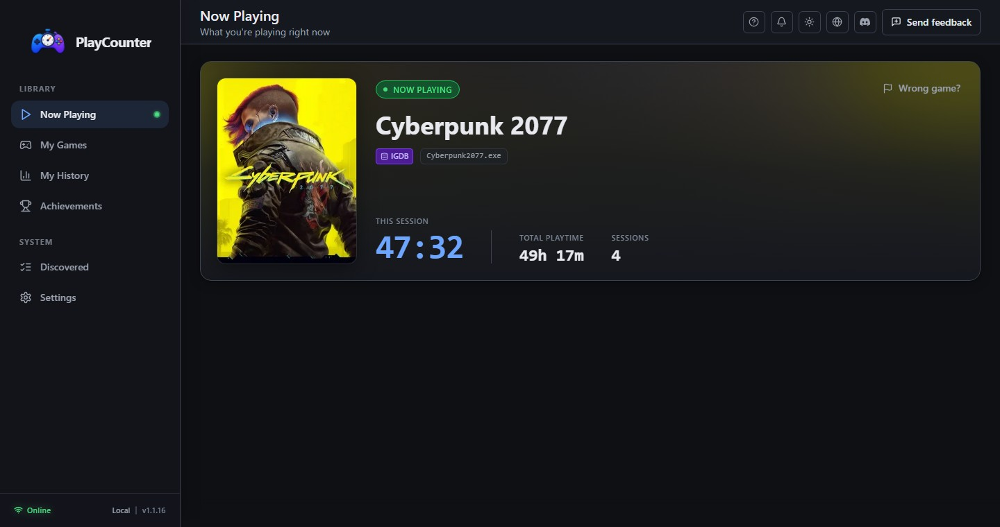
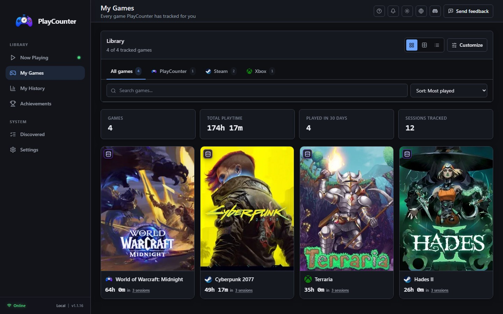
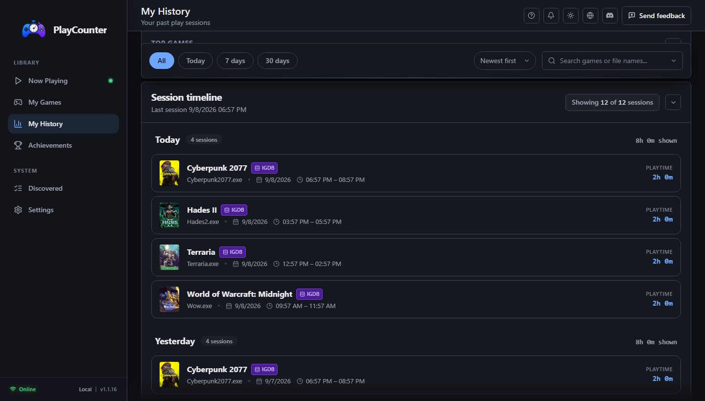

# PlayCounter

**Automatic playtime tracking for Windows, regardless of launcher.**

[](https://github.com/zntr1/PlayCounter/releases/latest)
[](./LICENSE)
[](https://discord.gg/t2nG3jaEEY)

PlayCounter watches what's actually running on your PC and records playtime for
recognized games, regardless of how they were launched (Steam, Epic, GOG, EA,
Ubisoft, Battle.net, a shortcut, or a plain `.exe`). Unknown games can be added
locally or submitted as community matches for review. Sessions and recent
history stay on the PC, and the free, open-source app does not require an
account.

Different AI models supported me in developing this application.

## Download

**[Download the latest release for Windows →](https://github.com/zntr1/PlayCounter/releases/latest)**

The official release page includes release notes, checksums and available
security-scan results for checking your download. The public installer is for
Windows; macOS and Linux are planned.

## Screenshots

Screenshots show the 1.1.16 interface with example data.



|                                          Game library                                           |                                Session history                                 |
| :---------------------------------------------------------------------------------------------: | :----------------------------------------------------------------------------: |
|  |  |

## Why the desktop client is open source

PlayCounter watches your running processes to know when a game starts and stops.
That only works if you trust it. The complete desktop client is open so you can
inspect the process scanner, local storage, and every network request the app
makes. Public contracts document the data exchanged with the matching service.

The production API, database migrations, ingestion pipeline, and operational
deployment code are maintained privately. This does not change the MIT rights
for backend versions that were already published. The exact historical boundary
and the current public/private split are documented in [BACKEND.md](./BACKEND.md).

## Privacy

- Play tracking happens **locally** on your machine - your history stays there.
- Presence reporting automatically sends your pseudonymous installation ID on
  startup and hourly while running, including in the tray. These reports contain
  no game names or history. The server keeps first/latest report timestamps;
  inactive records are removed after 30 days during hourly cleanup. This is used to determine, whether
  stronger hardware capacity for the PlayCounter online services are needed.
- Automatic game matching sends the required process identifier to the API. On
  Windows this is the executable filename, never its full path.
- Feedback and community game submissions are only sent when you choose those
  actions. No PlayCounter account is required.
- The on-demand Steam importer reads local Steam files and sends only AppIDs
  from the selected local account for metadata resolution; account names,
  playtime, and install paths are not uploaded.
- The optional Xbox importer uses Microsoft sign-in in your browser. The API
  temporarily handles authorization and Xbox game data for that import; the app
  does not see your Microsoft password.
- DOSBox and Dolphin detection reads local emulator process information. Online
  matching can send extracted game identifiers, filenames or titles; full
  command lines are not uploaded in those automatic matching requests.
- A blacklist lets you exclude any executable from tracking.

See the [privacy policy](https://playcounter.app/datenschutz#en) for data flows
and retention details.

## Features

- Detects recognized games by watching running processes, with no per-launcher
  setup and no requirement to launch through PlayCounter
- Add local entries for games or other processes you choose to track
- Automatic executable-to-game matching against the API
- Steam and Xbox imports for available previous playtime, with game matching
  and review before import; overlapping provider totals are not added together
- Dedicated per-game DOSBox and Dolphin detection, with local review for
  uncertain matches
- Searchable game library with provider tabs, grid/list layouts and custom covers
- Session history and statistics, manual entries and playtime adjustments
- Optional game-launch actions, desktop overlays and configurable shortcuts
- Local backup export and import
- Current / "now playing" view with a system-tray indicator
- Community suggestions and one-time local choices for unknown or ambiguous exes
- Configurable polling and unmatched-retry intervals plus an executable blacklist
- Built-in auto-updater

## Project structure

This is a pnpm + Turborepo monorepo:

| Path              | Description                                                        |
| ----------------- | ------------------------------------------------------------------ |
| `apps/desktop`    | Tauri 2 + React 19 + TypeScript desktop app (Rust process scanner) |
| `packages/shared` | Public TypeScript API and local model contracts                    |
| `landing`         | Marketing landing page                                             |

## Getting started

Requires [Node.js](https://nodejs.org/), [pnpm](https://pnpm.io/) (via Corepack),
and the [Rust toolchain](https://www.rust-lang.org/tools/install) plus the
[Tauri prerequisites](https://v2.tauri.app/start/prerequisites/) for your OS.

```bash
corepack enable
pnpm install
```

Run the desktop app in dev mode:

```bash
pnpm desktop:dev
```

Build the desktop app:

```bash
pnpm desktop:build
```

The production client uses the matching service at `api.playcounter.app`.
Desktop tests mock that boundary and do not require access to the private
backend repository.

## License

[MIT](./LICENSE) © zntr1. The license covers the files in the current public
repository. Previously published backend copies retain the MIT rights documented
in [BACKEND.md](./BACKEND.md).
